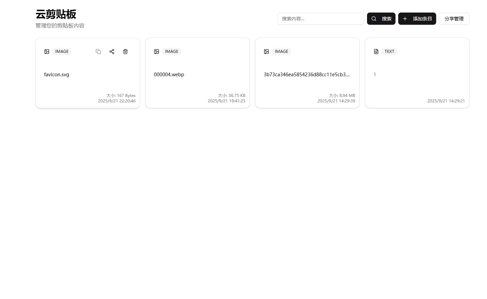
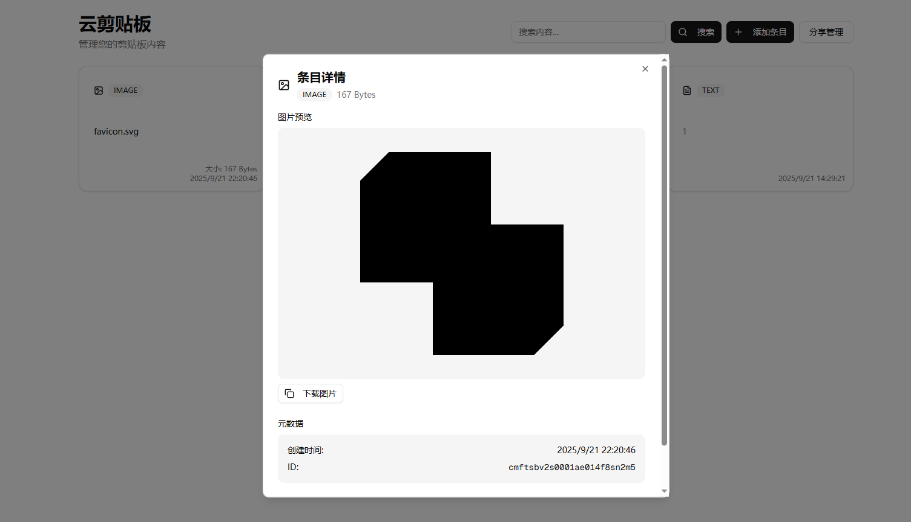

# Cloud Clipboard

[English](README.md) | [简体中文](README.zh-CN.md)

A self-hosted cloud clipboard for quickly sharing text snippets, files, and images across devices. The app is built with Next.js and provides realtime updates, drag-and-drop uploads, and lightweight authentication suitable for personal or small-team use.

## Features
- Realtime clipboard synchronization via Socket.IO and SQLite
- Upload text, files, and pasted images with progress feedback
- Drag-and-drop reordering powered by `@dnd-kit`
- Full-text search across clipboard content and filenames
- Optional password gate stored in sessionStorage
- Responsive UI built from shadcn/ui components and Tailwind CSS 4

[**Screenshots**]
- Home: 
- Detail dialog: 

## Architecture Overview
- **Frontend**: Next.js App Router (React 19) with shadcn/ui component primitives and Tailwind CSS 4 for styling (`src/app`, `src/components/ui`)
- **Server**: Custom Node entry (`server.ts`) bootstraps Next.js and attaches a Socket.IO server for realtime events
- **Data**: SQLite via better-sqlite3 + drizzle-orm (`src/lib/db.ts`, `src/lib/db/schema.ts`)
- **Auth**: Minimal bearer password check handled in `src/app/api/auth/verify/route.ts`
- **Realtime**: Websocket events broadcast create/delete actions (`src/lib/socket.ts`, `src/lib/socket-events.ts`)

## Getting Started
### Prerequisites
- Node.js 20+
- npm 10+

### Install dependencies
```bash
npm ci
```
> Use `npm ci` to keep dependency versions aligned with `package-lock.json`. This avoids accidental upgrades that can break the Tailwind/PostCSS toolchain.

### Development
```bash
npm run dev
```
The server uses `nodemon` + `tsx` to reload `server.ts`. Open http://localhost:8087 in your browser (or set `PORT=xxxx`).

### Production build
```bash
npm run build
npm start
```
`npm start` launches the custom server in production mode. Tables are created automatically on first start if the SQLite file is empty. The server listens on `PORT` (default 8087).

## Environment Variables
Create a `.env` file based on the included example:

```
DATABASE_URL="file:../data/custom.db"
CLIPBOARD_PASSWORD="change-me"
```
- `DATABASE_URL` points to the SQLite database file. Supports `file:relative/or/absolute/path.db` or a plain file path. If not set, the app falls back to `./data/custom.db` automatically.
- `CLIPBOARD_PASSWORD` controls access to the UI; users must enter the password once per session.

## Docker

Two image variants are available:

- `:latest` (default) — built from `Dockerfile`. Easiest to use.
- `:slim` — built from `Dockerfile.slim`. Smaller and faster to pull. First-time empty volume is auto-initialized at runtime.

### Build locally
```bash
# Regular image
docker build -t cloud-clipboard:latest -f Dockerfile .

# Slim image
docker build -t cloud-clipboard:slim -f Dockerfile.slim .
```

### Pull prebuilt images
```bash
# Replace with your registry/namespace used in CI
docker pull $REGISTRY/$NAMESPACE/cloud-clipboard:latest
docker pull $REGISTRY/$NAMESPACE/cloud-clipboard:slim

# Versioned (immutable) tags per commit SHA are also published:
docker pull $REGISTRY/$NAMESPACE/cloud-clipboard:sha-$GITHUB_SHA
docker pull $REGISTRY/$NAMESPACE/cloud-clipboard:slim-$GITHUB_SHA
```

### Run with Docker Compose (recommended)
Create `.env` with at least:
```
DATABASE_URL="file:../data/custom.db"
CLIPBOARD_PASSWORD="change-me"
```

Compose example (map the data directory for persistence):
```
services:
  app:
    # For reproducible deploys, prefer the SHA tag:
    # image: $REGISTRY/$NAMESPACE/cloud-clipboard:sha-$GITHUB_SHA
    # Or track latest for convenience:
    image: $REGISTRY/$NAMESPACE/cloud-clipboard:latest
    ports:
      - "8087:8087"
    env_file: .env
    volumes:
      - /srv/cloud-clipboard/data:/app/data
    restart: unless-stopped
    pull_policy: always
```

#### First-time init note for `:slim`
No manual step is needed anymore. The app creates tables on first start when the SQLite file is empty.

## CI / Workflow

The GitHub Actions workflow is now manual to avoid building on every push. Trigger it from the Actions tab:

- Workflow name: "Build and Push Docker Image"
- Event: `workflow_dispatch` (Run workflow)
- Optionally toggle whether to also build/push the `slim` image via the input parameter.

## Project Structure
```
src/
├─ app/              # App Router pages, API routes, layout, global styles
├─ components/ui/    # Reusable shadcn/ui wrappers
├─ hooks/            # Custom hooks (toast, mobile detection)
└─ lib/              # Auth, DB, socket helpers, util functions
src/lib/db/schema.ts # Drizzle ORM schema (SQLite)
server.ts            # Custom Next.js + Socket.IO server entry point
```

## License
MIT  - Please refer to [LICENSE](LICENSE)
