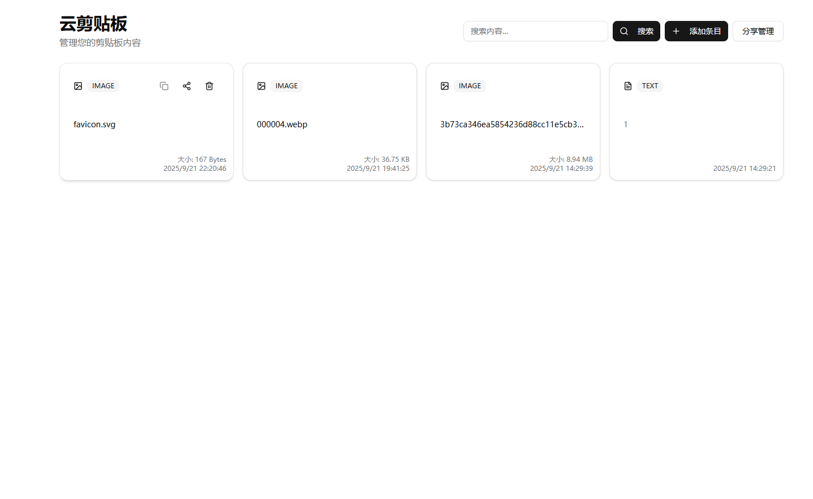

# 云剪贴板（Cloud Clipboard）

[English](README.md) | 简体中文

一个自托管的云剪贴板应用，用于在设备间快速分享文本、图片和文件。基于 Next.js 构建，支持实时同步、拖拽上传和轻量认证，适合个人或小团队使用。

- 实时同步：通过 SSE（Server-Sent Events）广播新建/删除事件
- 拖拽上传：小文件内联存储，大文件落地到磁盘
- 轻量认证：单一访问口令，浏览器会话内记住
- 响应式 UI：基于 shadcn/ui 与 Tailwind CSS 4

## 界面截图
- 主页：
- 详情对话框：

## 架构概览
- 前端：Next.js App Router（React 19），组件库 `src/app`, `src/components/ui`
- 服务端：自定义入口 `server.ts`，通过 `/api/events` 提供 SSE 实时通道
 - 数据：SQLite（better-sqlite3 + drizzle-orm，`src/lib/db.ts`, `src/lib/db/schema.ts`）
- 认证：`/api/auth/verify` 验证口令，并写入会话 Cookie
- 实时：`src/app/api/events/route.ts`, `src/lib/socket-events.ts`

## 快速开始（本地开发）
### 依赖
- Node.js 20+
- npm 10+

### 安装依赖
```bash
npm ci
```

### 初始化数据库（首次）
无需手动执行迁移。应用在首次启动时会检测并自动创建表结构（SQLite 文件为空时）。

### 启动开发服务
```bash
npm run dev
```
打开 `http://localhost:8087`。

## 生产构建与运行
```bash
npm run build
npm start
```
- `npm start` 直接启动服务；若 SQLite 文件为空，会在首次访问前自动创建表结构。
- 监听端口 `8087`（可通过 `PORT` 覆盖）。

## 环境变量
在项目根目录创建 `.env`（最少包含以下两项）：

```
DATABASE_URL="file:../data/custom.db"
CLIPBOARD_PASSWORD="change-me"
```
- `DATABASE_URL` 指向 SQLite 数据库文件。支持 `file:相对或绝对路径` 或直接文件路径。不设置时默认使用项目根的 `./data/custom.db`。
- `CLIPBOARD_PASSWORD` 为访问口令。前端会将口令存入会话；服务端中间件会校验请求头或 Cookie。

## Docker 部署
### 本地构建镜像
```bash
# 完整镜像
docker build -t cloud-clipboard:latest -f Dockerfile .

# 精简镜像（体积更小）
docker build -t cloud-clipboard:slim -f Dockerfile.slim .
```

### 使用 Docker Compose（推荐）
1) 准备 `.env`：
```
DATABASE_URL="file:../data/custom.db"
CLIPBOARD_PASSWORD="change-me"
```
2) Compose 示例（持久化数据目录）：
```
services:
  app:
    image: <your-registry>/cloud-clipboard:latest
    ports:
      - "8087:8087"
    env_file: .env
    volumes:
      - /srv/cloud-clipboard/data:/app/data
    restart: unless-stopped
```

### 首次初始化（仅 `:slim` 镜像）
无需额外步骤。首次挂载空卷启动时，应用会自动创建表结构。

## 数据存储与备份
- 数据库：`data/custom.db`（SQLite，含元数据与小文件 BLOB）
- 大文件：`data/uploads/`（启动时自动创建，API 流式读取）
- 备份/迁移时请同时备份上述两处。

## 使用提示与常见问题
- 复制按钮与 HTTP 环境
  - 浏览器的剪贴板 API 需要“安全上下文”（HTTPS 或 localhost）。在 HTTP 环境下，系统复制可能受限。
  - 本应用已内置降级与提示：HTTPS/localhost 下会直接复制；HTTP 下会提示并选中文本，便于手动复制。建议在生产启用 HTTPS 以获得最佳体验。

## 目录结构
```
src/
├─ app/              # App Router 页面、API 路由、layout、全局样式
├─ components/ui/    # 可复用 UI 组件封装
├─ components/clipboard/ # 剪贴板业务组件
├─ hooks/            # 自定义 hooks（toast 等）
└─ lib/              # 鉴权、数据库、SSE、工具函数
src/lib/db/schema.ts # Drizzle SQLite 表结构定义
server.ts            # 自定义 Next.js 服务器入口（SSE 实时）
```

## 许可证
MIT  - 请参阅 [LICENSE](LICENSE)
